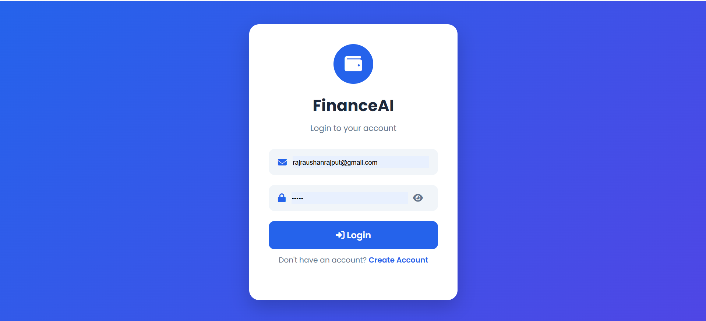
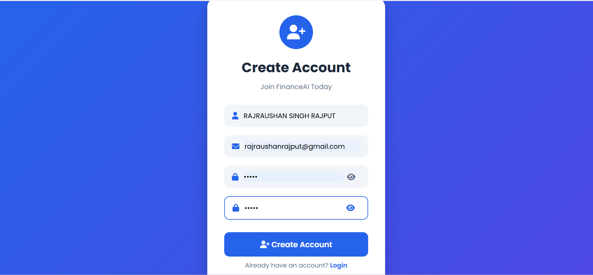
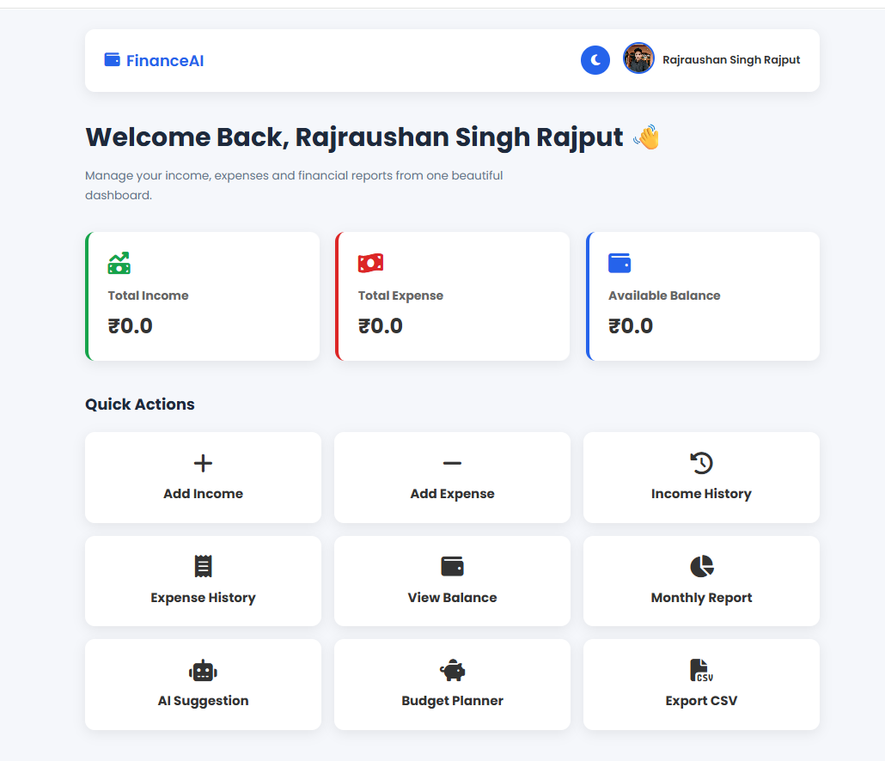
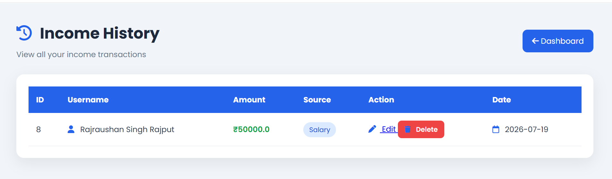
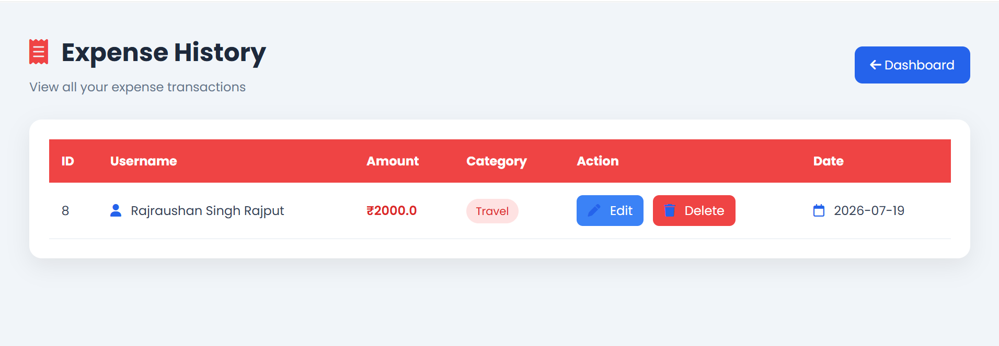
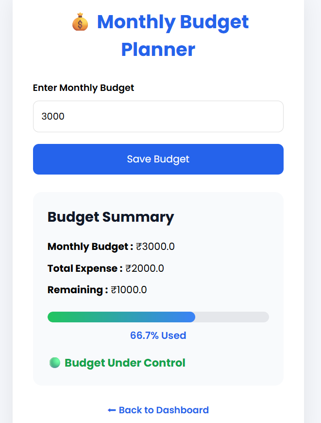
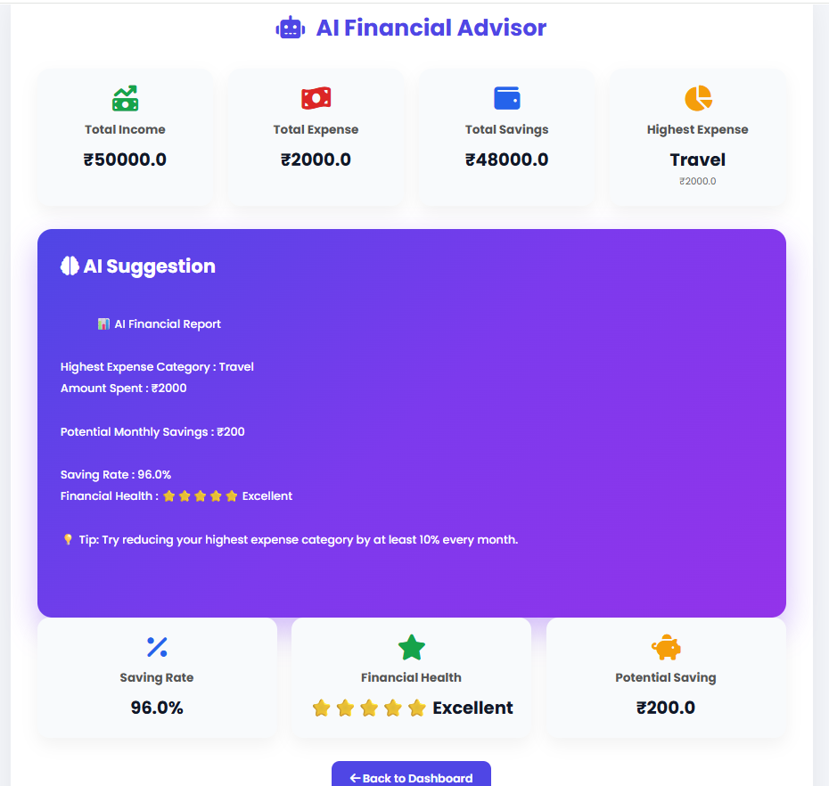

# 💰 AI Personal Finance Manager

A modern Personal Finance Management Web Application built using **Python, Flask, SQLite, HTML, CSS, and JavaScript**.

This application helps users manage their daily finances by tracking income, expenses, savings, monthly budget, and AI-based financial suggestions.

---

# 🚀 Features

- 👤 User Registration & Login
- 🔐 Secure Password Hashing
- 💰 Add Income
- 💸 Add Expense
- 📜 Income History
- 📜 Expense History
- ✏️ Edit Income & Expense
- 🗑️ Delete Income & Expense
- 📊 Dashboard with Charts
- 🤖 AI Financial Advisor
- 💵 Budget Planner
- 📈 Budget Progress Tracking
- 🌙 Dark Mode
- 👤 Profile Photo Upload
- 📄 Export Report as PDF
- 📥 Export Income as CSV
- 📱 Fully Responsive Design
- ❌ Custom 404 Error Page

---

# 🛠️ Technologies Used

- Python
- Flask
- SQLite3
- HTML5
- CSS3
- JavaScript
- Chart.js
- Font Awesome

---

# 📂 Project Structure

```text
AI_Personal_Finance_Manager/
│
├── static/
│   ├── css/
│   ├── js/
│   ├── images/
│
├── templates/
│
├── screenshots/
│
├── finance.db
├── app.py
├── requirements.txt
├── README.md
```

---

# 📸 Project Screenshots

## 🔐 Login Page



---

## 📝 Register Page



---

## 📊 Dashboard



---

## 💰 Income History



---

## 💸 Expense History



---

## 💵 Budget Planner



---

## 🤖 AI Financial Advisor



---

# ⚙️ Installation

Clone the repository

```bash
git clone https://github.com/your-username/AI_Personal_Finance_Manager.git
```

Go to project folder

```bash
cd AI_Personal_Finance_Manager
```

Create Virtual Environment

```bash
python -m venv venv
```

Activate Virtual Environment

### Windows

```bash
venv\Scripts\activate
```

Install Dependencies

```bash
pip install -r requirements.txt
```

Run the Application

```bash
python app.py
```

Open Browser

```
http://127.0.0.1:5000
```

---

# 🎯 Future Improvements

- Email Notifications
- Expense Prediction
- Monthly Analytics
- Multi-language Support
- Cloud Database
- AI Expense Forecasting

---

# 👨‍💻 Author

**Rajraushan**

BCA (Data Science & AI)

Python | Flask | HTML | CSS | JavaScript

---

# ⭐ If you like this project

Please consider giving this repository a ⭐ on GitHub.
